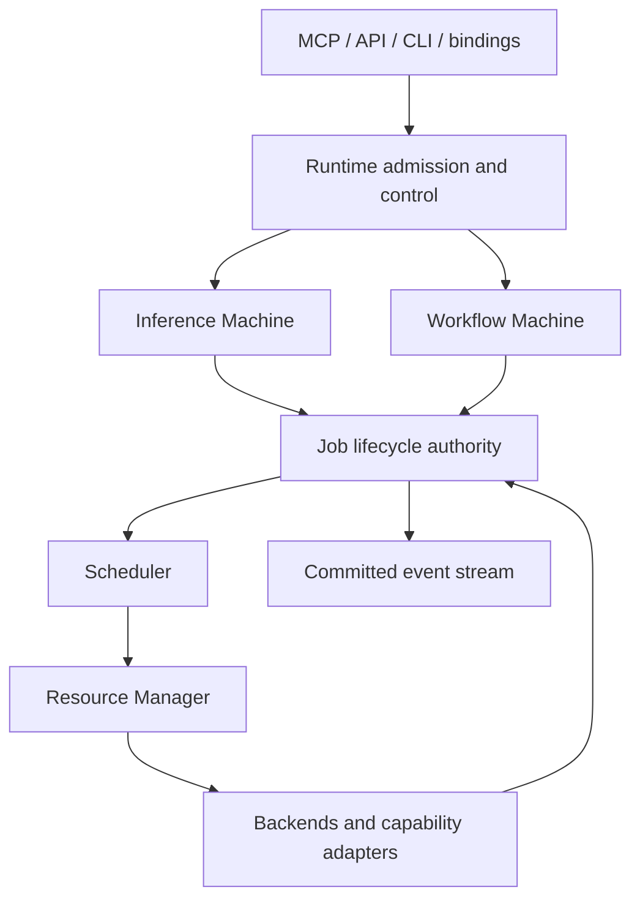

# Architecture

## Status and purpose

**Phase A architecture proposal. No Runtime is implemented.**

FLAMORIS AI Runtime is a single-user native model execution kernel: inference and workflow share one controllable loop. It owns model execution/state and coordinates bounded child work. An external provider is a registered Workflow capability, never its interchangeable inference backend.

[Design Phases](DESIGN_PHASES.md) defines review gates and document authority. This overview delegates precise behavior to the detailed contracts rather than duplicating transition tables.

## Authority boundaries

| Authority | Owns | Does not own |
| --- | --- | --- |
| Runtime Kernel | Run admission, Job lifecycle, execution control, limits and provenance | Caller identity/memory or host-wide service policy |
| Inference Machine | Tokenize/prefill/decode/sampling coordination and backend state for its Job | Independent terminal status, ambient tool authority |
| Workflow Machine | Immutable compiled plan, dependencies, binding, join/race decisions | Arbitrary code or a second Scheduler |
| Scheduler | Selection of eligible Jobs under current resource/policy constraints | Continuation scheduling, external service authority |
| Resource Manager | Reservations, execution leases, physical allocation accounting and cleanup debt | Claiming host exclusivity from a local lock |
| Capability Registry | Versioned schemas, effects and adapter capability descriptions | Permission to invoke a registered capability |
| Paid Budget Authority (optional future integration) | Strict monetary guarantees for external paid capabilities when explicitly enabled | Baseline native inference or Run/Job recovery |
| Agent | Identity, goals, personality, conversation and durable memory | Runtime lifecycle state |
| Generation | Generation workflows, service Jobs and media assets | Runtime Job identity and lifecycle |
| GPU Node Manager | Host-wide device/service lifecycle and coordination | Runtime dependency decisions |
| Studio / desktop products | Accounts, UI, documents and edit history | Kernel execution semantics |

Intelligence MCP may expose or route bounded intelligence capabilities without forcing model execution internals out of AI Runtime. Exact integration protocols require evidence in Phase B; this architecture does not assert what neighboring services currently implement.

## Kernel structure

This is one logical control architecture, not a requirement to execute all computation on one thread. Backend observations return through the Job authority. A callback cannot directly resurrect a terminal Job or bypass policy.

C++ is the intended Kernel language. Transports, bindings and external services preserve the same semantics. See [Implementation Strategy](IMPLEMENTATION_STRATEGY.md).

## Run, Job and machines

A Run is an admitted bounded execution with a principal, immutable plan reference, cancellation scope, budgets and a root Job. Jobs are the only scheduler-visible units; machines advance their Jobs and report control decisions to the Kernel.

A workflow node and a Job are distinct. Nodes describe logical operations; materialized Jobs have runtime identities and attempts. A remote Generation/MCP request may create a service-owned operation ID linked in provenance, never reused as the Runtime Job ID.

The [Execution Model](EXECUTION_MODEL.md) owns plan instantiation, bounded dynamic child envelopes, binding, dependency readiness, join/race and external operation relationships. The [State Machines](STATE_MACHINES.md) own Run/Job transitions, control precedence, deadlines and terminalization.

Useful computation finishing does not mean all ownership has ended. `finalizing` settles descendants and resources, or transfers explicit bounded cleanup debt, before terminal publication. Cancellation is a stop request with acknowledgement and outcome semantics, not rollback.

## Continuation ownership

A Continuation belongs to exactly one waiting/paused Job. It contains a resume point, bounded bindings, wait condition and valid state references. It has no scheduling, timeout or cancellation authority of its own.

On wake/resume eligibility, the Kernel atomically consumes it into a Job-owned pending resume payload and queues the same Job. The payload survives resource waits and is disposed on cancellation; it is not a second Continuation queue. Dispatch rechecks current authorization, deadlines, capability compatibility and resources before consuming pending state into the active machine.

State references may retain VRAM/RAM. Releasing an execution lease proves neither release nor preservation of that state. The Resource Manager accounts allocations until release is acknowledged or uncertainty is explicitly quarantined.

## Compilation and bounded dynamic work

Workflow IR passes validation and compilation before scheduling. The Execution Plan pins schemas/capability contracts, normalized dependencies and bindings, effects, budgets, resource bounds and potential suspension policy. It contains no live Continuation, secret or authorization grant.

The compiler does static analysis, admission establishes current bounded authority, and every dispatch/retry/resume checks current permission. Capability/contract changes cannot silently alter an existing plan.

Inference may propose work at a runtime safe point. That proposal is untrusted input and must fit the plan's declared child-capability/scope/effect/count/depth/budget envelope. The Kernel validates it before creating ordinary child Jobs. No dynamic endpoint import or mutable graph shortcut is allowed.

See [Workflow IR](WORKFLOW_IR.md) and [Authorization Model](AUTHORIZATION_MODEL.md).

## Inference control and backend capabilities

The intended decoder control boundary is after an internally consistent state update: prefill/decode, sampling, token/state update, committed observation, control request application, then the next segment. Exact safe points and maximum segment bounds must be established for the selected backend in Phase B.

A backend advertises independently whether it supports streaming, cooperative cancellation, state-preserving suspension, offload/snapshot, bounded input injection and rewind. An opaque server call must not advertise decode control merely because its transport streams tokens.

Preservation compatibility includes model/backend/configuration and state generation. Re-tokenization or re-inference after discarding KV/sampler state is a new execution strategy, not equivalent resume. Unsupported requested control is rejected explicitly.

Backend compute abstractions do not force CUDA, ROCm, Vulkan, OpenCL or one model architecture into the public Runtime contract. This is an architectural requirement, not a compatibility claim about any runtime today.

## Resources and host coordination

[Resource Model](RESOURCE_MODEL.md) separates execution permission, unmaterialized reservations, unique physical allocations, retained state, soft affinity and quarantine. Shared model allocations count once physically; per-Run quotas remain enforced.

Acquisition covers the complete incremental vector before useful execution. Offload temporarily accounts source and target. Waiting parents whose retained state prevents child progress must offload through an approved supported path or fail explicitly; releasing a lease is not a solution to memory deadlock.

Host authority must provide an enforceable operating envelope. Unknown/stale resource generation blocks affected dispatch and resume. The Kernel cannot reset a device or stop unrelated services to make its budget fit.

Later model-residency optimization may reorder only eligible work within dependency, effect, fairness, priority and deadline constraints. A linear workflow cannot be reordered merely to reduce reload cost.

## Effects and authorization

Effects are a validated nonempty set: `pure`, `read`, `write`, `external`, `destructive`, `paid`. `pure` is exclusive; `read` is ambient/mutable-state access beyond declared immutable inputs; `destructive` requires `write`; `external` and `paid` are orthogonal attributes. Unknown/contradictory metadata fails closed.

Plan-level aggregation validates each member first, then combines observable effects without retaining `pure` beside them. An effect set is neither an authorization grant nor proof of idempotency. Current input-specific scopes, cost reservations and registered adapter restrictions control dispatch.

[Authorization Model](AUTHORIZATION_MODEL.md) defines revocation, confirmation binding, budget accounting, deduplication and uncertainty. The baseline Run ledger enforces finite local limits without promising a hard monetary ceiling across crashes. A future strict paid profile requires separate durable authority and cannot restore a crashed Run. Raw credentials, arbitrary endpoints, ambient shell/filesystem/network authority and model-authored permission claims are excluded.

## Events, failure and replay

Structured committed events are the observation contract. [Event Model](EVENT_MODEL.md) defines per-Run ordering, atomic groups, result/terminal ordering, bounded payloads, gaps, subscriber backpressure and inspection-only replay. Event subscribers are not execution authority.

[Failure Model](FAILURE_MODEL.md) defines sanitized errors, child propagation, retry constraints, response-loss uncertainty, cleanup and crash behavior. A timeout does not establish that a remote write failed. Cancelled local execution does not prove rollback of paid or completed effects.

Trace replay reads retained evidence and never invokes models, tools, authorization side effects or cleanup. The baseline is non-durable execution; a process crash may leave incomplete evidence and external operations in flight. Restart does not recreate leases or Continuations from events.

## Scope and review

The initial scope is a single-user FLAMORIS native model runtime, bounded DAG/control semantics, CPU reference and OpenCL compute. GUI metadata is non-semantic. Durable Agent memory, training, distributed scheduling, arbitrary code, a plugin marketplace, universal pause/rewind and speculative result replacement remain outside the baseline.

Before freezing interfaces, Phase B must inspect current `flamoris-net/flamoris-LLM` and current primary-source runtime contracts for llama.cpp, Transformers, vLLM and TensorRT-LLM. Public documents must not copy private topology/code. The product direction is FLAMORIS native execution; Phase A does not claim it is implemented or validated.

[Design Acceptance](DESIGN_ACCEPTANCE.md) defines the cross-component scenarios required before implementation and their later deterministic test obligations.
